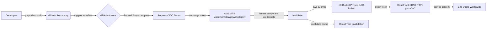

# AjokeTechHub — Automated Cloud Deployment Pipeline
CI/CD pipeline for automated AWS S3 deployments via GitHub Actions
## Executive Summary

This project implements a secure, fully automated CI/CD pipeline that deploys a static website from a GitHub repository to a globally distributed HTTPS endpoint using AWS S3 and CloudFront. Every push to `main` triggers an automated security and quality gate, followed by a keyless deployment to AWS using OpenID Connect (OIDC) — eliminating the need for long-lived AWS access keys entirely.

## Note on CloudFront Deployment Status

During implementation, AWS placed a standard account-level verification hold on this account before allowing new CloudFront distributions — a routine check applied to newer AWS accounts, unrelated to any configuration in this project. A support case was opened with AWS and is currently pending resolution.

All CloudFront-side configuration — Origin Access Control, distribution config, and the CloudFront-scoped bucket policy — is fully built and documented in this repository, ready to activate the moment the account is verified. The cache-invalidation step in `deploy.yml` is included but commented out pending the distribution ID.

For live demonstration purposes, the static site is temporarily accessible via S3 static website hosting: `[paste your S3 website URL here]`

## 1. Business Problem

Manual website deployment introduces three recurring risks in production environments:

- **Security exposure**: Static AWS access keys stored in CI systems are a common breach vector — if leaked, they grant standing access until manually rotated.
- **Manual error**: Hand-deployed changes (console uploads, manual cache clears) are inconsistent and unauditable.
- **Latency**: Serving content from a single origin region degrades performance for geographically distributed users.

This pipeline solves all three: OIDC removes standing credentials, GitHub Actions makes every deployment identical and logged, and CloudFront's edge network solves latency globally.

## 2. Architecture



### Key Architectural Decisions

| Decision | Why |
|---|---|
| **OIDC over static IAM keys** | Temporary, minutes-long credentials issued per workflow run instead of a permanent secret sitting in GitHub. Eliminates the risk of a leaked long-lived key. |
| **CloudFront OAC over public S3** | The S3 bucket has Block Public Access enabled on all four settings. Only the specific CloudFront distribution (verified via Origin Access Control and SigV4 signing) can read from it. Direct S3 URL access returns 403. |
| **IAM trust policy scoped to exact repo + branch** | The role's trust policy matches the exact repository, owner ID, and `main` branch — pull requests get linted and scanned but never receive deploy credentials. |

## 3. AWS Infrastructure

**Account ID:** `541673202339`
**Region:** `us-east-1`

### Resources created:
- **S3 Bucket:** `ajoketechhub-site-1787731351` — private, versioned, Block Public Access enabled
- **IAM OIDC Provider:** `token.actions.githubusercontent.com`
- **IAM Role:** `github-actions-s3-deploy-role`

## 4. CI/CD Workflow (`.github/workflows/deploy.yml`)

Two-job pipeline:

1. **lint-and-scan** — validates HTML and runs a Trivy security/filesystem scan on every push. Must pass before deployment proceeds.
2. **deploy** — assumes the IAM role via OIDC, syncs the `site/` directory to S3 with appropriate cache headers (long-cache for assets, no-cache for HTML), then invalidates the CloudFront cache.

See the full workflow file in [`.github/workflows/deploy.yml`](.github/workflows/deploy.yml).

## 5. Deployment Instructions (Reproduce This Project)

```bash
# 1. Clone the repository
git clone https://github.com/Ajokemi/github-actions-aws-s3-cicd.git
cd github-actions-aws-s3-cicd

# 2. Configure AWS CLI with your own credentials
aws configure

# 3. Create your own S3 bucket, IAM OIDC provider, IAM role, and CloudFront
# distribution following the AWS CLI commands documented above,
# substituting your own AWS account ID and bucket name.

# 4. Update the role ARN and bucket name in .github/workflows/deploy.yml

# 5. Push to main — the pipeline runs automatically
git push origin main
```

## 6. Security Controls Mapping

| Risk | Mitigation |
|---|---|
| Leaked long-lived AWS credentials | OIDC federation — zero standing keys, temporary credentials only |
| Public data exposure | S3 Block Public Access (all 4 settings) + CloudFront OAC |
| Unauthorized deploy from forks/PRs | IAM trust policy scoped to exact repo, owner ID, and `main` branch only |
| Vulnerable/malformed code shipped | Trivy scan + HTML validation gate before deploy job runs |
| Stale cached content served | Automated CloudFront cache invalidation on every deploy |

## 7. Screenshots

actual screenshot saved in a `/assets` folder in this repo

**GitHub Repository Structure** — full file tree showing `.github/workflows/`, `site/`, `README.md`
**GitHub Actions Workflow File** — `deploy.yml` open in the GitHub code view
**Successful Pipeline Run** — green checkmark on the Actions tab, both jobs passed
**Live HTTPS Site** — browser screenshot showing the CloudFront URL loading the site with the padlock/HTTPS indicator

## 8. Live Demo Proof Point

```bash
# Direct S3 access — blocked
curl -I https://ajoketechhub-site-1787731351.s3.amazonaws.com/index.html
# Expected: HTTP/1.1 403 Forbidden

# CloudFront access — works
curl -I https://[YOUR-CLOUDFRONT-DOMAIN].cloudfront.net/index.html
# Expected: HTTP/2 200
```

This proves the bucket is genuinely private and only reachable through the authorized CDN path.

---

**Author:** Ajoke (Ajokemi)
**Stack:** GitHub Actions, AWS IAM (OIDC), Amazon S3, Amazon CloudFront, Trivy
